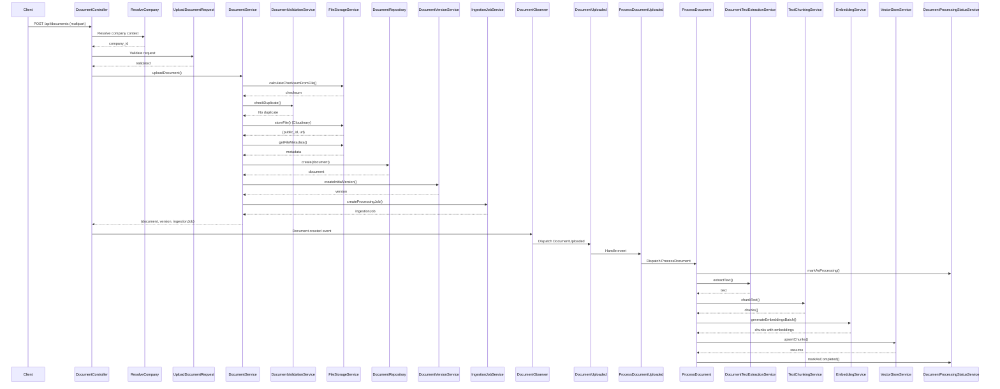

# Document Upload Flow Documentation

## Overview

This document outlines the complete document upload and processing pipeline, from initial API request to vector storage in Qdrant. Each step is marked as either **✅ COMPLETED** or **⏳ TODO** for future implementation.

## Flow Diagram

## Step-by-Step Flow

### Phase 1: Request & Validation

#### Step 1.1: API Endpoint

-   **Status**: ✅ **COMPLETED**
-   **Location**: `routes/api.php` → `POST /api/documents`
-   **Controller**: `app/Http/Controllers/V1/Api/DocumentController@upload`
-   **Middleware**: `auth:sanctum`, `company.scope`
-   **Details**:
    -   Accepts multipart/form-data
    -   Requires authentication
    -   Company context resolved via middleware
    -   Logs admin action for audit trail

#### Step 1.2: Company Context Resolution

-   **Status**: ✅ **COMPLETED**
-   **Location**: `app/Http/Middleware/ResolveCompany.php`
-   **Details**:
    -   Superadmin: Uses `X-Company-Id` header for impersonation
    -   Regular users: Uses assigned `company_id`
    -   Validates company exists and is accessible
    -   Sets `current_company_id` in request attributes
    -   Sets `impersonated_company` in request attributes

#### Step 1.3: Request Validation

-   **Status**: ✅ **COMPLETED**
-   **Location**: `app/Http/Requests/UploadDocumentRequest.php`
-   **Validation Rules**:
    -   ✅ File: required, mimes (pdf,docx,txt,html,md), max 10MB
    -   ✅ Title: nullable, string, max 500 chars
    -   ✅ Description: nullable, string
    -   ✅ Tags: nullable, array
    -   ✅ Language: nullable, 2-char code
-   **Details**:
    -   File size and MIME type validation handled here
    -   Data preparation (trimming, array normalization)
    -   Custom error messages for better UX

---

### Phase 2: File Processing & Storage

#### Step 2.1: Calculate File Checksum

-   **Status**: ✅ **COMPLETED**
-   **Location**: `app/Services/V1/Document/Upload/FileStorageService@calculateChecksumFromFile`
-   **Implementation**: SHA-256 hash of file content
-   **Purpose**: Duplicate detection before storage
-   **Note**: Calculated from uploaded file in memory, before storage

#### Step 2.2: Duplicate Detection

-   **Status**: ✅ **COMPLETED**
-   **Location**: `app/Services/V1/Document/Upload/DocumentValidationService@checkDuplicate`
-   **Implementation**:
    -   Checks `documents` table for matching `company_id` + `checksum`
    -   Throws exception if duplicate found
-   **Note**: Checks before file storage to avoid unnecessary uploads to Cloudinary

#### Step 2.3: File Storage to Cloudinary

-   **Status**: ✅ **COMPLETED**
-   **Location**: `app/Services/V1/Document/Upload/FileStorageService@storeFile`
-   **Implementation**:
    -   Uploads to Cloudinary using PHP SDK
    -   Returns `public_id` and `file_url`
    -   Organizes files by company: `docwise/documents/{companyId}/{uuid}`
-   **Storage**: Cloudinary (not local server)
-   **Returns**: `['public_id' => string, 'url' => string]`
-   **Configuration**: `config/cloudinary.php` and `config/services.php`

#### Step 2.4: Get File Metadata

-   **Status**: ✅ **COMPLETED**
-   **Location**: `app/Services/V1/Document/Upload/FileStorageService@getFileMetadata`
-   **Returns**:
    -   `original_filename`
    -   `mime_type`
    -   `file_size`
    -   `extension`

---

### Phase 3: Database Records Creation

#### Step 3.1: Create Document Record

-   **Status**: ✅ **COMPLETED**
-   **Location**: `app/Services/V1/Document/DocumentService@uploadDocument`
-   **Repository**: `app/Repositories/V1/DocumentRepository@create`
-   **Fields Stored**:
    -   ✅ Basic info: `title`, `description`, `source_type`, `file_type`
    -   ✅ Storage: `public_id`, `file_url` (Cloudinary)
    -   ✅ Metadata: `original_filename`, `mime_type`, `file_size`, `checksum`
    -   ✅ User data: `language`, `tags`, `metadata`
    -   ✅ Status: `status = 'uploaded'`
    -   ✅ User tracking: `uploaded_by` (user ID)
-   **Transaction**: Wrapped in `DB::transaction()` for atomicity

#### Step 3.2: Create Initial Document Version

-   **Status**: ✅ **COMPLETED**
-   **Location**: `app/Services/V1/Document/DocumentVersionService@createInitialVersion`
-   **Repository**: `app/Repositories/V1/DocumentVersionRepository@create`
-   **Details**:
    -   Creates version 1
    -   Sets `processing_state = 'pending'`
    -   Links to document via `document_id`
    -   Follows repository pattern for data access

#### Step 3.3: Create Ingestion Job Record

-   **Status**: ✅ **COMPLETED**
-   **Location**: `app/Services/V1/Document/IngestionJobService@createProcessingJob`
-   **Repository**: `app/Repositories/V1/IngestionJobRepository@create`
-   **Details**:
    -   Job type: `parse_document`
    -   Status: `queued`
    -   Priority: `0` (normal)
    -   Max attempts: `3`
    -   Auto-sets `queued_at` timestamp
    -   Follows repository pattern for data access

---

### Phase 4: Event-Driven Processing Trigger

#### Step 4.1: Document Created Event

-   **Status**: ✅ **COMPLETED**
-   **Location**: `app/Observers/DocumentObserver@created`
-   **Trigger**: Eloquent `created` event on `Document` model
-   **Condition**: Only fires for `source_type = 'upload'` and `status = 'uploaded'`
-   **Action**: Dispatches `DocumentUploaded` event
-   **Registration**: Registered in `app/Providers/AppServiceProvider.php`

#### Step 4.2: Event Listener

-   **Status**: ✅ **COMPLETED**
-   **Location**: `app/Listeners/ProcessDocumentUploaded@handle`
-   **Event**: `App\Events\DocumentUploaded`
-   **Registration**: `app/Providers/EventServiceProvider.php`
-   **Action**: Dispatches `ProcessDocument` job to queue
-   **Queue**: Implements `ShouldQueue` for async processing
-   **Details**: Passes `document_id`, `version_id`, and `ingestion_job_id` to job

---

### Phase 5: Document Processing Pipeline

#### Step 5.1: Mark as Processing

-   **Status**: ✅ **COMPLETED**
-   **Location**: `app/Services/V1/Document/Processing/DocumentProcessingStatusService@markAsProcessing`
-   **Updates**:
    -   Document: `status = 'processing'`
    -   Version: `processing_state = 'processing'`
    -   IngestionJob: `status = 'processing'`, `started_at = now()`

#### Step 5.2: Extract Text from Document

-   **Status**: ⚠️ **PARTIAL** (Text files ✅, PDF/DOCX ⏳ TODO)
-   **Location**: `app/Services/V1/Document/Processing/DocumentTextExtractionService@extractText`
-   **Completed**:
    -   ✅ Text-based files (txt, html, md): Direct content extraction from Cloudinary URL
    -   ✅ Cloudinary URL retrieval (uses stored `file_url` or generates from `public_id`)
    -   ✅ Temporary file management for binary files
    -   ✅ Error handling with `TextExtractionException`
    -   ✅ Cleanup of temporary files in finally block
-   **TODO**:
    -   ⏳ **PDF Text Extraction**: Install `spatie/pdf` and implement `extractPdfText()` method
    -   ⏳ **DOCX Text Extraction**: Install `phpoffice/phpword` and implement `extractDocxText()` method
    -   ⏳ Progress tracking for large files
    -   ⏳ Support for additional file types (if needed)

#### Step 5.3: Chunk Text into Smaller Pieces

-   **Status**: ⚠️ **PARTIAL** (Basic implementation ✅, Advanced features ⏳ TODO)
-   **Location**: `app/Services/V1/Document/Processing/TextChunkingService@chunkText`
-   **Completed**:
    -   ✅ Basic chunking with overlap
    -   ✅ Company-specific chunk size configuration
    -   ✅ Sentence boundary detection (basic)
    -   ✅ DocumentChunk record creation
    -   ✅ Token count estimation (rough approximation)
    -   ✅ Metadata storage in chunks
-   **TODO**:
    -   ⏳ **Proper Tokenization**: Implement using tiktoken or similar library for accurate token counting
    -   ⏳ **Semantic Splitting**: Split by sentences/paragraphs for better semantic boundaries
    -   ⏳ **Edge Case Handling**: Handle very short text, single sentence, etc.
    -   ⏳ **Overlap Strategy**: Improve overlap logic for better context preservation

#### Step 5.4: Generate Embeddings

-   **Status**: ⚠️ **PARTIAL** (Basic HTTP implementation ✅, Production features ⏳ TODO)
-   **Location**: `app/Services/V1/Document/Processing/EmbeddingService@generateEmbeddingsBatch`
-   **Completed**:
    -   ✅ Single embedding generation via OpenAI API (HTTP client)
    -   ✅ Batch processing loop (processes chunks in batches)
    -   ✅ Company-specific embedding model configuration
    -   ✅ Error handling and logging
    -   ✅ Embedding dimension mapping for common models
    -   ✅ Stores embedding model in chunk metadata
-   **TODO**:
    -   ⏳ **OpenAI SDK**: Install `openai-php/laravel` for better integration
    -   ⏳ **Retry Logic**: Add exponential backoff for failed requests
    -   ⏳ **Rate Limiting**: Implement rate limiting to respect API limits
    -   ⏳ **Batch API Calls**: Use OpenAI batch API (supports up to 2048 inputs per request)
    -   ⏳ **Token Usage Tracking**: Log token usage to `usage_metrics` table
    -   ⏳ **Timeout Handling**: Process in smaller batches to avoid timeout
    -   ⏳ **Dynamic Dimensions**: Make embedding dimensions configurable or fetch from API

#### Step 5.5: Store Vectors in Qdrant

-   **Status**: ⚠️ **PARTIAL** (Basic HTTP implementation ✅, Production features ⏳ TODO)
-   **Location**: `app/Services/V1/Document/Processing/VectorStoreService@upsertChunks`
-   **Completed**:
    -   ✅ Collection creation/verification
    -   ✅ Batch upsert of vectors to Qdrant
    -   ✅ Point ID assignment (uses chunk UUID)
    -   ✅ Payload storage (chunk metadata, content, IDs)
    -   ✅ Update chunks with `qdrant_point_id` and `qdrant_collection`
    -   ✅ Delete by document functionality
    -   ✅ Error handling and logging
-   **TODO**:
    -   ⏳ **Qdrant SDK**: Use official Qdrant PHP SDK instead of raw HTTP calls
    -   ⏳ **Connection Pooling**: Implement connection pooling for better performance
    -   ⏳ **Batch Size Optimization**: Optimize batch size for Qdrant API limits
    -   ⏳ **Index Management**: Implement proper index management and optimization
    -   ⏳ **Collection Configuration**: Make collection settings configurable (distance metric, etc.)
    -   ⏳ **Error Recovery**: Implement retry logic for failed upserts

#### Step 5.6: Update Version Metadata

-   **Status**: ✅ **COMPLETED**
-   **Location**: `app/Jobs/ProcessDocument@handle`
-   **Updates**:
    -   `chunk_count`: Total number of chunks created
    -   `embedding_model`: Model used for embeddings
-   **Note**: Updated after successful chunking and embedding generation

#### Step 5.7: Mark as Completed

-   **Status**: ✅ **COMPLETED**
-   **Location**: `app/Services/V1/Document/Processing/DocumentProcessingStatusService@markAsCompleted`
-   **Updates**:
    -   Document: `status = 'completed'`, `processed_at = now()`
    -   Version: `processing_state = 'completed'`
    -   IngestionJob: `status = 'completed'`, `completed_at = now()`
-   **Logging**: Success log with document, version, and job IDs, plus chunk count

---

### Phase 6: Error Handling

#### Step 6.1: Processing Failure Handling

-   **Status**: ✅ **COMPLETED**
-   **Location**: `app/Jobs/ProcessDocument@handleFailure`
-   **Implementation**:
    -   Catches exceptions during processing
    -   Logs error with full trace
    -   Marks document, version, and ingestion job as failed
    -   Updates error messages in version and ingestion job
    -   Sets `failed_at` timestamp
-   **Service**: Uses `DocumentProcessingStatusService@markAsFailed`

#### Step 6.2: Job Retry Logic

-   **Status**: ✅ **COMPLETED**
-   **Location**: `app/Jobs/ProcessDocument`
-   **Configuration**:
    -   `$tries = 3`: Maximum retry attempts
    -   `$timeout = 300`: 5-minute timeout per attempt
-   **Note**: Laravel queue system handles automatic retries

---

### Phase 7: Document Deletion (Cleanup)

#### Step 7.1: Delete Document

-   **Status**: ⚠️ **PARTIAL** (File deletion ✅, Vector cleanup ⏳ TODO)
-   **Location**: `app/Services/V1/Document/DocumentService@deleteDocument`
-   **Completed**:
    -   ✅ Soft delete document record
    -   ✅ Delete file from Cloudinary using `public_id`
    -   ✅ Repository pattern for data access
-   **TODO**:
    -   ⏳ **Qdrant Cleanup**: Queue cleanup job to delete vectors from Qdrant
    -   ⏳ **Cascade Deletion**: Delete related chunks, versions, and ingestion jobs
    -   ⏳ **Hard Delete Option**: Implement hard delete for compliance (GDPR, etc.)

---

## Architecture Patterns

### SOLID Principles

-   ✅ **Single Responsibility**: Each service has a focused responsibility
-   ✅ **Open/Closed**: Services are extensible without modification
-   ✅ **Liskov Substitution**: Interfaces allow for implementation swapping
-   ✅ **Interface Segregation**: Focused interfaces (e.g., `DocumentServiceInterface`)
-   ✅ **Dependency Inversion**: Services depend on abstractions (repositories, interfaces)

### Repository Pattern

-   ✅ **DocumentRepository**: Handles document data access
-   ✅ **DocumentVersionRepository**: Handles version data access
-   ✅ **IngestionJobRepository**: Handles ingestion job data access
-   **Benefits**: Separation of concerns, easier testing, database-agnostic code

### Event-Driven Architecture

-   ✅ **Observer Pattern**: `DocumentObserver` watches model events
-   ✅ **Event/Listener**: `DocumentUploaded` event triggers processing
-   ✅ **Queue Integration**: Async processing via Laravel queues
-   **Benefits**: Decoupling, scalability, fault tolerance

---

## Configuration Files

### Cloudinary Configuration

-   **Location**: `config/cloudinary.php`, `config/services.php`
-   **Settings**: Cloud name, API key, API secret, upload folder structure

### Qdrant Configuration

-   **Location**: `config/qdrant.php`
-   **Settings**: Host, port, API key

### OpenAI Configuration

-   **Location**: `config/services.php`
-   **Settings**: API key for embeddings

---

## Database Schema

### Documents Table

-   Stores document metadata, file references (`public_id`, `file_url`), checksum, status
-   **Key Fields**: `uuid`, `company_id`, `public_id`, `file_url`, `status`, `checksum`

### Document Versions Table

-   Tracks document processing versions
-   **Key Fields**: `document_id`, `version`, `processing_state`, `chunk_count`, `embedding_model`

### Document Chunks Table

-   Stores text chunks with metadata
-   **Key Fields**: `document_id`, `version_id`, `chunk_index`, `content`, `token_count`, `qdrant_point_id`

### Ingestion Jobs Table

-   Tracks processing jobs
-   **Key Fields**: `document_id`, `status`, `job_type`, `priority`, `queued_at`, `started_at`, `completed_at`

---

## Summary

### Completed Features ✅

1. **Request Handling**: API endpoint, validation, company context resolution
2. **File Management**: Checksum calculation, duplicate detection, Cloudinary storage
3. **Database Operations**: Document, version, and job record creation
4. **Event System**: Observer-based event dispatching, async job queuing
5. **Text Extraction**: Text-based files (txt, html, md)
6. **Text Chunking**: Basic chunking with overlap and sentence boundaries
7. **Embedding Generation**: Basic OpenAI API integration
8. **Vector Storage**: Basic Qdrant integration for vector storage
9. **Status Management**: Processing status tracking and updates
10. **Error Handling**: Comprehensive error handling and logging

### Pending Implementation ⏳

1. **PDF/DOCX Extraction**: Install libraries and implement text extraction
2. **Advanced Tokenization**: Use tiktoken for accurate token counting
3. **Semantic Chunking**: Improve chunking with better boundary detection
4. **OpenAI SDK**: Migrate to official SDK with retry logic and rate limiting
5. **Batch Embeddings**: Use OpenAI batch API for efficiency
6. **Usage Tracking**: Log token usage to metrics table
7. **Qdrant SDK**: Use official SDK instead of raw HTTP calls
8. **Vector Cleanup**: Implement Qdrant cleanup on document deletion
9. **Progress Tracking**: Add progress tracking for large file processing

---

## Next Steps

1. **Phase 1 - Foundation** (Week 1):

    - Implement PDF/DOCX text extraction
    - Integrate OpenAI PHP SDK
    - Set up basic Qdrant SDK

2. **Phase 2 - Optimization** (Week 2):

    - Implement proper tokenization
    - Add batch embedding processing
    - Optimize Qdrant operations

3. **Phase 3 - Production Ready** (Week 3):
    - Add retry logic and rate limiting
    - Implement usage tracking
    - Add progress tracking and monitoring

---

_Last Updated: 2025-01-27_
